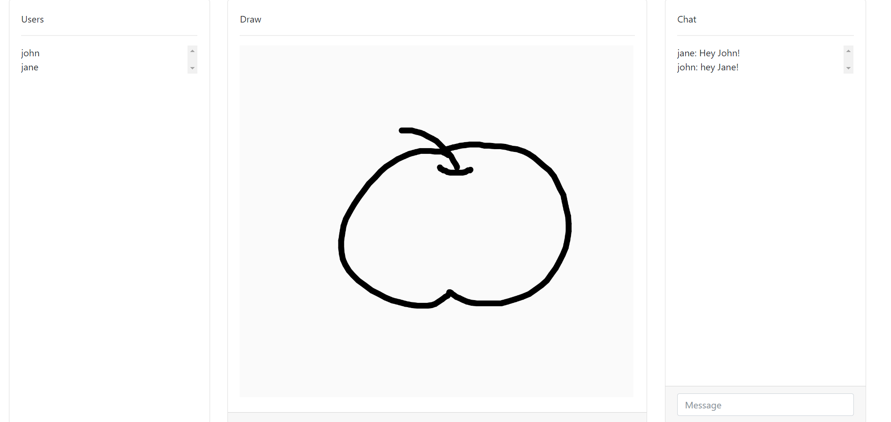

# Draw Together 

Draw Together is a shared canvas game where one player draws a word, and the other players tries to guess it.

## Installation

### Requirements
* refer to package.json

## Current Progress


## Deployment
You can deploy to heroku following the basic procedures.
i.e. after settupng Heroku CLI and your project:
```
$ git add .
$ git commit -am "make it better"
$ git push heroku master
```

## Contributing
Pull requests are welcome. For major changes, please open an issue first to discuss what you would like to change.

Please make sure to update tests as appropriate.

## License
[MIT](https://choosealicense.com/licenses/mit/)